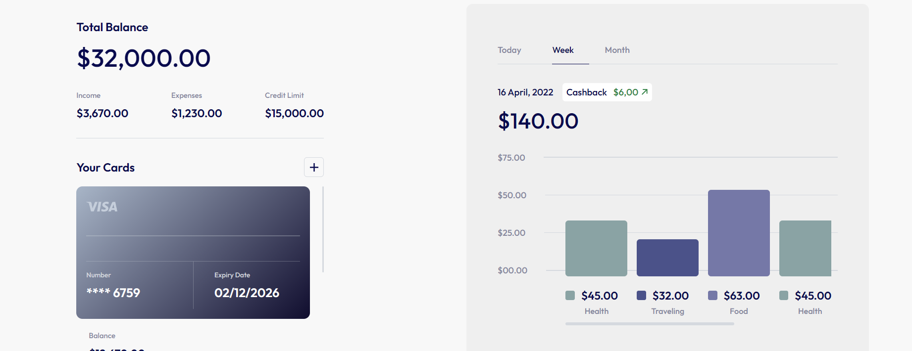

# 🏦 Online Banking System

A multi-module web application that simulates the core features of a modern online banking platform. This project provides a user-friendly interface for managing accounts, loans, credit cards, notifications, and bill payments—all accessible through a unified static website.

## 🌐 Tech Stack

- HTML5
- CSS3
- JavaScript (ES6+)

## ✨ Main Features

- **User Authentication:** Login and signup interfaces
- **Account Management:** Open, close, and manage bank accounts
- **Loan Services:** Apply for loans, use a loan calculator, and track application status
- **Credit Card Management:** View credit cards, apply for new cards, check points, and pay bills
- **Notifications:** Centralized notification center for reminders and announcements
- **Reports & Bill Payments:** Submit technical reports and pay utility bills online

## 📸 Screenshots

|               Login & Signup                |                    Loan Calculator                    |                      Credit Card Points                       |
| :-----------------------------------------: | :---------------------------------------------------: | :-----------------------------------------------------------: |
|  |  |  |

|                  Credit Cards                   |                 Pay Bills                 |               Reports               |
| :---------------------------------------------: | :---------------------------------------: | :---------------------------------: |
|  |  |  |

## 🚀 Getting Started

1. Download or clone this repository.
2. Open `unified-banking-app/index.html` in your web browser.
3. Use the navigation menu to explore all modules and features.

No installation or build steps are required. The application runs entirely in the browser.

## 📁 Project Structure

```
login_loan-Daniel/      # Login, signup, and loans
accounts-Rahma/         # Account management
CC-Karim/               # Credit card management
notis-Dina/             # Notifications
report_pay-Youssef/     # Reports and bill payments
unified-banking-app/    # Unified entry point and navigation
ScreenShots/            # UI screenshots for documentation
```

## 📄 Documentation

- [Architecture & Info](info-architecture.md)

## 🤝 Contributing

Contributions are welcome! Please open an issue or submit a pull request for improvements or bug fixes.

## 📄 License

This project is licensed under the MIT License.

## 🙏 Acknowledgments

- Project contributors
- Webflow (for initial UI design)
- Open-source community

---

<div align="center">
  <sub>Built with ❤️ by the Online Banking Team</sub>
</div>
